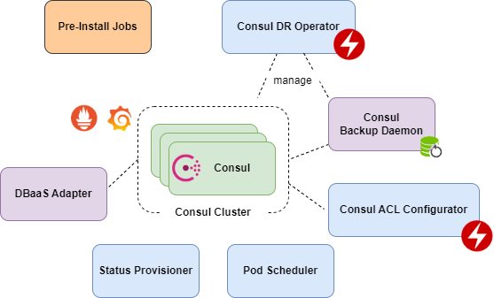
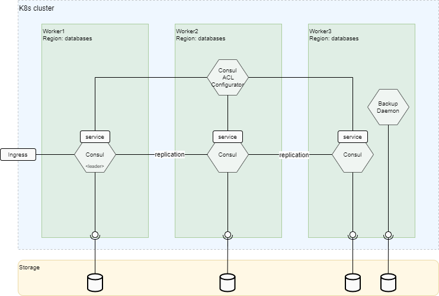
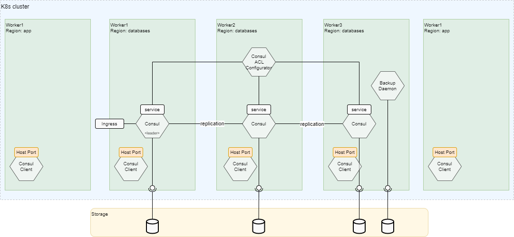
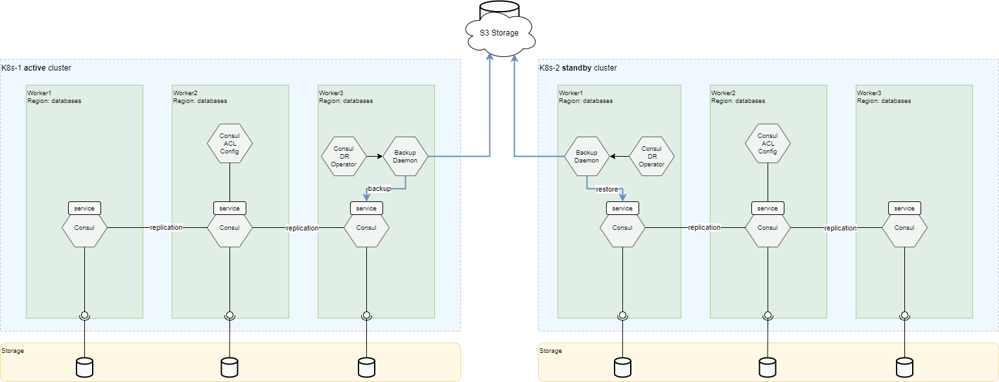

<!-- #GFCFilterMarkerStart# -->

<!-- TOC -->
* [Overview](#overview)
  * [Consul Delivery and Features](#consul-delivery-and-features)
* [Consul Components](#consul-components)
  * [Consul](#consul)
  * [Consul Client](#consul-client)
  * [Consul Backup Daemon](#consul-backup-daemon)
  * [Consul Disaster Recovery Operator](#consul-disaster-recovery-operator)
  * [Consul ACL Configurator](#consul-acl-configurator)
  * [Pod Scheduler](#pod-scheduler)
  * [Status Provisioner](#status-provisioner)
  * [Pre-Install Jobs](#pre-install-jobs)
* [Supported Deployment Schemes](#supported-deployment-schemes)
  * [On-Prem](#on-prem)
    * [HA Deployment Scheme](#ha-deployment-scheme)
    * [Non-HA Deployment Scheme](#non-ha-deployment-scheme)
    * [HA Deployment Scheme with Clients](#ha-deployment-scheme-with-clients)
    * [DR Deployment Scheme](#dr-deployment-scheme)
  * [Integration With Managed Services](#integration-with-managed-services)
<!-- TOC -->

# Overview

<!-- #GFCFilterMarkerEnd# -->

Consul is a service mesh solution providing a full-featured control plane with service discovery, configuration, 
and segmentation functionality.
Each of these features can be used individually as needed, or they can be used together to build a full service mesh.
Consul requires a data plane and supports both a proxy and native integration model.
Consul ships with a simple built-in proxy so that everything works out of the box, but also supports 3rd party proxy integrations such
as Consul DataPlane.

Consul is developed by [HashiCorp](https://www.hashicorp.com/products/consul/). 
The Qubership-Consul delivery provides official images of Consul and Consul k8s 
with changed deployment procedure. For more information about Consul, refer to the _Consul Introduction_ at 
[https://www.consul.io/intro/index.html](https://www.consul.io/intro/index.html).

The key features of Consul are:

* **Service Discovery**—Clients of Consul can register a service, such as api or mysql, and other clients can use Consul to discover
  providers of a given service. Using either DNS or HTTP, applications can easily find the services they depend upon.

* **Health Checking**—Consul clients can provide any number of health checks, either associated with a given service 
  ("is the webserver returning 200 OK"), or with the local node ("is memory utilization below 90%").
  The operator can use this information to monitor cluster health, and it is used by the service discovery components to
  route traffic away from unhealthy hosts.

* **KV Store**—Applications can make use of Consul's hierarchical key/value store for any number of purposes,
  including dynamic configuration, feature flagging, coordination, leader election, and more.
  The simple HTTP API makes it easy to use.

* **Secure Service Communication**—Consul can generate and distribute TLS certificates for services to establish mutual TLS connections.
  Intentions can be used to define which services are allowed to communicate.
  Service segmentation can be easily managed with intentions that can be changed in real time instead of using complex network topologies
  and static firewall rules.

* **Multi Datacenter**—Consul supports multiple datacenters out of the box.
  This means, users of Consul do not have to worry about building additional layers of abstraction to grow to multiple regions.

Deploying a Consul cluster, servers and clients, in Kubernetes can be done with the [Helm chart](/charts/helm/consul-service)
in this project. This configuration is useful for managing services within Kubernetes.

The Consul datacenter in Kubernetes functions same as a platform independent Consul datacenter, such as Consul clusters deployed on
bare metal servers or virtual machines.
Agents communicate over LAN gossip, servers participate in the Raft consensus, and client requests are forwarded to the servers via RPCs.

## Consul Delivery and Features

The Qubership-Consul provides Consul deployment to Kubernetes using helm chart based on community Consul Helm chart
with own services and additional features.
The deployment procedure and additional features include the following:

* Support HA scheme and different configurations.
  For more detailed information, refer to [Installation Guide](/docs/public/installation.md).
* Backup and restore data. For more detailed information,
  refer to [Consul Backup Daemon Guide](https://github.com/netcracker/consul-backup-daemon/blob/main/documentation/maintenance-guide/development-guide/README.md).
* Monitoring integration with Grafana Dashboard and Prometheus Alerts. For more detailed information,
  refer to [Monitoring Guide](/docs/public/monitoring.md).
* User Interface (UI) provided by Consul UI.
* Disaster Recovery scheme with data replication via backup and restore. For more detailed information,
  refer to [Disaster Recovery Guide](/docs/public/disaster-recovery.md).

# Consul Components

## Consul

The Consul is an original Hashicorp Consul pod. It is a powerful tool used in cloud environments for service discovery and configuration
management. 
It acts as a centralized registry, allowing microservices to register and discover each other dynamically. 
Consul also provides health checking and load balancing functionalities, ensuring high availability (HA) of services within a cluster.

## Consul Client

The Consul client agent is a component of Consul that runs as a DaemonSet pod on every worker node in a Kubernetes cluster. 
Its purpose is to establish a connection between the Consul server and the individual nodes, enabling seamless communication,
and coordination within the cluster.

**NOTE:** At the moment this component is going to be deprecated and disabled by default due to complicated management and lack of real
business cases in the company.

## Consul Backup Daemon

The Consul Backup Daemon is a microservice that offers a convenient REST API for performing backups and restores of Consul data.
It enables users to initiate backups and restores programmatically, making it easier to automate these processes.
Additionally, the daemon allows users to schedule regular backups, ensuring data protection and disaster recovery.
Furthermore, it offers the capability to store backups on remote S3 storage, providing a secure and scalable solution for
long-term data retention.

## Consul Disaster Recovery Operator

The Consul Disaster Recovery operator is a Kubernetes operator designed to facilitate the orchestration of switchover
and failover operations using the backup and restore feature of the Consul Backup Daemon.
This operator enables organizations to efficiently manage disaster recovery scenarios within a Consul-based infrastructure.

The operator works in tandem with the Consul Backup Daemon, which handles the actual backup and restore processes.
The backup daemon captures the state of the Consul cluster, including key-value data, service definitions, and ACL configurations,
and stores them securely for disaster recovery purposes. 
In the event of a failure or planned switchover, the operator coordinates the restoration of the Consul cluster from the backup,
ensuring seamless continuity of services.

## Consul ACL Configurator

The Consul ACL configurator is a Kubernetes operator that operates as a microservice and is responsible for 
managing Access Control List (ACL) configurations for Consul in a Kubernetes environment.
It monitors and watches for changes in the ACL config custom resource, which allows users to define and update ACL rules in
a Kubernetes-native way.

As a Kubernetes operator, the Consul ACL configurator automatically reconciles the desired state of the ACL configurations with
the actual state in Consul. This means that, any changes made to the ACL config custom resource will be applied to Consul in
a seamless and automated manner, ensuring consistent and up-to-date ACL rules.

By leveraging the Consul ACL configurator as a Kubernetes operator, organizations can streamline the management of ACL configurations,
taking advantage of Kubernetes' declarative approach to define and enforce access control policies in a Consul-based environment.
This integration enhances security and simplifies the administration of Consul ACLs in a Kubernetes-native way.

## Pod Scheduler

The Pod Scheduler is a service running as a pod in Kubernetes, is responsible for binding specific pods of the Consul StatefulSet
to designated Kubernetes nodes based on configuration. 
This scheduler ensures that pods requiring host-path persistent volumes are assigned to the appropriate nodes, aligning with
the defined configuration. 
By orchestrating this allocation process, the scheduler optimizes resource utilization and enables efficient utilization
of host-path persistent volumes within the Kubernetes cluster.

## Status Provisioner

The Status Provisioner service is designed to monitor the health of all Consul components 
and further relaying information for integrated platforms.
It checks the availability and functionality of various Consul components after deployment that they are functioning properly. 
By providing this status information in the Deployer contract, the Status Provisioner service enables seamless integration
with other systems that rely on the health and operational status of Consul components.
After providing status the Status Provisioner pod is auto-removed.

## Pre-Install Jobs

The set of pre-install hooks which allow to prepare environment for Consul installation. It includes:

* TLS Init Job - generate self-signed certificates for Consul modules.
* ACL Init Job - configure security and bootstrap token.

# Supported Deployment Schemes

The supported deployment schemes are specified in this section.

## On-Prem

The deployment schemes for On-Prem are specified in the below sub-sections.
 
### HA Deployment Scheme

The HA deployment scheme is shown in the following image:

Following the above pictures, let us describe the main parts of the Consul K8s deployment:

* The minimal number of replicas for HA scheme of Consul is 3.
* Consul pods are distributed through Kubernetes nodes and availability zones based on affinity policy during deployment.
* Each Consul pod has its own Persistent Volume storage.
* In addition to Consul main storage, the Consul Backup Daemon pod has its own Persistent Volume for backups.
* All components are deployed by Helm.

### Non-HA Deployment Scheme

For a non-HA deployment scheme, it is possible to use one pod of Consul cluster.

### HA Deployment Scheme with Clients

The HA deployment scheme with clients is described in this section.

In this scheme, Consul Client pods are deployed for each Kubernetes nodes and expose access via Host Port 8500. 
When this scheme is applied, every microservice can access consul just using HOST_IP:8500 without discovery of Consul server.
But this scheme requires specific privileges due to exposing ports and not recommended in latest releases. 

### DR Deployment Scheme

The DR deployment scheme is described in this section.

The Consul provides the one scheme for disaster recovery: it is replication of data via backup and restore operations
during switchover and failover (blue arrows).
This scheme is more detailed described in [Disaster Recovery Guide](/docs/public/disaster-recovery.md).

## Integration With Managed Services

Not Applicable: Default HA scheme is used for deployment to Google Cloud.
