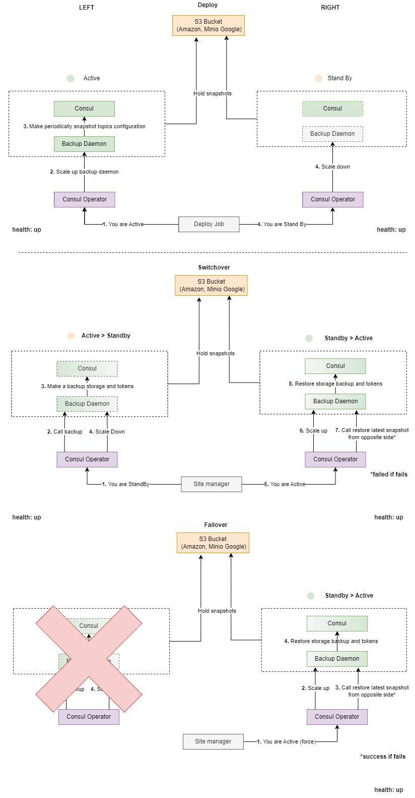

The section provides information about Disaster Recovery in Consul service.

The topics covered in this section are:

- [Common Information](#common-information)
- [Configuration](#configuration)
    - [Example](#example)
- [Consul Cross Cluster Replication](#consul-cross-cluster-replication)
- [Switchover](#switchover)
- [REST API](#rest-api)
- [Troubleshooting Guide](/docs/public/troubleshooting.md)

# Common Information

The Disaster Recovery scheme implies two separate Consul clusters, one of which is in the `active` mode, 
and the other is in the `standby` mode.



The process includes making backups of Consul data on `active` side before switching and then restoring them on `standby` side. 
It also performs periodically backups on `active` side.

The Consul backup and restore procedure backups all data including roles, policies, tokens and restores the complete state of cluster.

In case of switchover the Consul Disaster Recovery daemon waits the backup was performed successfully on `active` side and
then was successfully restored on `standby` side.
In case of failover the Consul Disaster Recovery daemon does not guarantee last backup to be restored.

# Configuration

The Disaster Recovery (DR) configuration requires two separate Consul clusters installed on two Kubernetes/OpenShift clusters.
First, you need to configure the parameters for Consul and all the components that you need to deploy to cloud.
Then, pay attention to the following steps that are significant for Disaster Recovery configuration:

1. The parameter that enables the DR scheme has to be set. You need to decide in advance about the mode, `active`, `standby`
   or `disabled` that is used during current Consul cluster installation and set the value in the following parameter:

    ```yaml
    global:
      ...
      disasterRecovery:
        mode: "active"
        region: "us-central"
    ```

2. The parameter that describes services after which Consul service switchover has to be run.

    ```yaml
    global:
      ...
      disasterRecovery:
        afterServices: ["app"]
    ```

   In common case Consul service is a base service and does not have any `after` services.

3. In DR scheme, Consul Backup Daemon should be deployed with S3 storage:

    ```yaml
    backupDaemon:
      install: true
      s3:
        enabled: true
        url: "https://s3.storage.com"
        bucket: "consul-dr"
    ```

For more information about Consul service parameters, refer to the **[Configuration](/docs/public/installation.md#parameters)** 
section in the _Consul Service Installation Procedure_.

## Example

You want to install Consul service in Disaster Recovery scheme. Each Consul cluster is located in `consul-service` namespace,
has 3 Consul servers with enabled ACLs.

The configuration for `active` Consul cluster is as follows:

```yaml
global:
  enablePodSecurityPolicies: true
  acls:
    manageSystemACLs: true
  disasterRecovery:
    mode: "active"
    region: "k8s1"

server:
  enabled: true
  replicas: 3
  storageClass: storage-class

ui:
  enabled: true
  ingress:
    enabled: true
    hosts:
      - host: consul-consul-service.k8s-1.kubernetes.example.com

backupDaemon:
  enabled: true
  backupSchedule: "0 * * * *"
  s3:
    enabled: true
    url: "https://s3.storage.com"
    bucket: "consul-dr"
```

The configuration for `standby` Consul cluster is as follows:

```yaml
global:
  enablePodSecurityPolicies: true
  acls:
    manageSystemACLs: true
  disasterRecovery:
    mode: "standby"
    region: "k8s2"

server:
  enabled: true
  replicas: 3
  storageClass: storage-class

ui:
  enabled: true
  ingress:
    enabled: true
    hosts:
      - host: consul-consul-service.k8s-2.kubernetes.example.com

backupDaemon:
  enabled: true
  backupSchedule: "0 * * * *"
  s3:
    enabled: true
    url: "https://s3.storage.com"
    bucket: "consul-dr"
```

# Consul Cross Cluster Replication

# Switchover

You can perform the switchover using the `SiteManager` functionality or Consul disaster recovery REST server API.

<!-- #GFCFilterMarkerStart# -->
For more information about `SiteManager`, refer to 
[Site Manager](https://github.com/Netcracker/DRNavigator/blob/main/documentation/public/architecture.md#site-manager) article.
<!-- #GFCFilterMarkerEnd# -->

If you want to perform a switchover manually, you need to switch `active` Consul cluster to `standby` mode and then switch `standby`
Consul cluster to `active` mode. You need to run the following command from within Consul Disaster Recovery pod on the `active` side:

```sh
curl -XPOST -H "Content-Type: application/json" http://<CONSUL_FULLNAME>-disaster-recovery.<NAMESPACE>:8080/sitemanager -d '{"mode":"standby"}'
```

Then you should run the following command from within Consul Disaster Recovery pod on the `standby` side:

```sh
curl -XPOST -H "Content-Type: application/json" http://<CONSUL_FULLNAME>-disaster-recovery.<NAMESPACE>:8080/sitemanager -d '{"mode":"active"}'
```

Where:

* `<CONSUL_FULLNAME>` is the fullname of Consul. For example, `consul`.
* `<NAMESPACE>` is the OpenShift/Kubernetes project/namespace of the Consul cluster side. For example, `consul-service`.

All Consul disaster recovery REST server endpoints can be secured via Kubernetes JWT Service Account Tokens.
To enable disaster recovery REST server authentication the `global.disasterRecovery.httpAuth.enabled` deployment parameter must be `true`.
The example for secured `sitemanager` GET endpoint is the following:

```sh
curl -XGET -H "Authorization: Bearer <TOKEN>" http://<CONSUL_FULLNAME>-disaster-recovery.<NAMESPACE>:8080/sitemanager
```

The example for secured `sitemanager` POST endpoint is the following:

```sh
curl -XPOST -H "Content-Type: application/json" -H "Authorization: Bearer <TOKEN>" http://<CONSUL_FULLNAME>-disaster-recovery.<NAMESPACE>:8080/sitemanager
```

Where `TOKEN` is Site Manager Kubernetes JWT Service Account Token.
The verification service account name and namespace are specified in `global.disasterRecovery.httpAuth.smServiceAccountName`
and `global.disasterRecovery.httpAuth.smNamespace` deployment parameters.

**NOTE:** If TLS for Disaster Recovery is enabled (`global.tls.enabled` and `global.disasterRecovery.tls.enabled`
parameters are set to `true`), use `https` protocol and `8443` port in API requests rather than `http` protocol and `8080` port.

For more information about Consul disaster recovery REST server API, see [REST API](#rest-api).

# REST API

Consul disaster recovery REST server provides three methods of interaction:

* `GET` `healthz` method allows finding out the state of the current Consul cluster side.
  If the current Consul cluster side is `active`, Consul and Consul Backup Daemon states are checked.
  You can run this method from within Consul Disaster Recovery pod as follows:

  ```sh
  curl -XGET http://<CONSUL_FULLNAME>-disaster-recovery.<NAMESPACE>:8080/healthz
  ```

  Where:

    * `<CONSUL_FULLNAME>` is the fullname of Consul. For example, `consul`.
    * `<NAMESPACE>` is the OpenShift/Kubernetes project/namespace of the Consul cluster side. For example, `consul-service`.

  All Consul disaster recovery REST server endpoints can be secured via Kubernetes JWT Service Account Tokens.
  To enable disaster recovery REST server authentication the `global.disasterRecovery.httpAuth.enabled` deployment parameter
  must be `true`. The example for secured `healthz` endpoint is the following:

  ```sh
  curl -XGET -H "Authorization: Bearer <TOKEN>" http://<CONSUL_FULLNAME>-disaster-recovery.<NAMESPACE>:8080/healthz
  ```

  Where `TOKEN` is Site Manager Kubernetes JWT Service Account Token.
  The verification service account name and namespace are specified in `global.disasterRecovery.httpAuth.smServiceAccountName`
* and `global.disasterRecovery.httpAuth.smNamespace` deploy parameters.

  The response to such request is as follows:

  ```json
  {"status":"up"}
  ```

  Where:

    * `status` is the current state of the Consul cluster side. The four possible status values are as follows:
        * `up` - Consul server stateful set and Consul backup daemon deployment are ready.
        * `degraded` - Consul server stateful set is ready and Consul backup daemon deployment is not ready.
        * `down` - Consul server stateful set is not ready.
        * `disabled` - The Consul service is switched off.

* `GET` `sitemanager` method allows finding out the mode of the current Consul cluster side and the actual state of the switchover 
  procedure. You can run this method from within Consul Disaster Recovery pod as follows:

  ```sh
  curl -XGET http://<CONSUL_FULLNAME>-disaster-recovery.<NAMESPACE>:8080/sitemanager
  ```

  Where:

    * `<CONSUL_FULLNAME>` is the fullname of Consul. For example, `consul`.
    * `<NAMESPACE>` is the OpenShift/Kubernetes project/namespace of the Consul cluster side. For example, `consul-service`.

  All Consul disaster recovery REST server endpoints can be secured via Kubernetes JWT Service Account Tokens.
  To enable disaster recovery REST server authentication the `global.disasterRecovery.httpAuth.enabled` deployment parameter
  must be `true`. The example for secured `sitemanager` GET endpoint is following:

  ```sh
  curl -XGET -H "Authorization: Bearer <TOKEN>" http://<CONSUL_FULLNAME>-disaster-recovery.<NAMESPACE>:8080/sitemanager
  ```

  Where `TOKEN` is Site Manager Kubernetes JWT Service Account Token. The verification service account name and namespace
  are specified in `global.disasterRecovery.httpAuth.smServiceAccountName` and `global.disasterRecovery.httpAuth.smNamespace`
  deploy parameters.

  The response to such a request is as follows:

  ```json
  {"mode":"standby","status":"done"}
  ```

  Where:

    * `mode` is the mode in which the Consul cluster side is deployed. The possible mode values are as follows:
        * `active` - Consul accepts external requests from clients and collects backups automatically.
        * `standby` - Consul accepts external requests from clients and does not collect backups automatically.
        * `disabled` - Consul accepts external requests from clients and does not collect backups automatically.
    * `status` is the current state of switchover for the Consul cluster side. The three possible status values are as follows:
        * `running` - The switchover is in progress.
        * `done` - The switchover is successful.
        * `failed` - Something went wrong during the switchover.
    * `comment` is the message which contains a detailed description of the problem and is only filled out if the `status` value
      is `failed`.

* `POST` `sitemanager` method allows switching mode for the current side of Consul cluster.
  You can run this method from within Consul Disaster Recovery pod as follows:

  ```sh
  curl -XPOST -H "Content-Type: application/json" http://<CONSUL_FULLNAME>-disaster-recovery.<NAMESPACE>:8080/sitemanager -d '{"mode":"<MODE>"}'
  ```

  Where:

    * `<CONSUL_FULLNAME>` is the fullname of Consul. For example, `consul`.
    * `<NAMESPACE>` is the OpenShift/Kubernetes project/namespace of the Consul cluster side. For example, `consul-service`.
    * `<MODE>` is the mode to be applied to the Consul cluster side. The possible mode values are as follows:
        * `active` - Consul accepts external requests from clients and collects backups automatically.
        * `standby` - Consul accepts external requests from clients and does not collect backups automatically.
        * `disabled` - Consul accepts external requests from clients and does not collect backups automatically.

  The response to such a request is as follows:

  All Consul disaster recovery REST server endpoints can be secured via Kubernetes JWT Service Account Tokens.
  To enable disaster recovery REST server authentication the `global.disasterRecovery.httpAuth.enabled` deployment 
  parameter must be `true`. The example for secured `sitemanager` POST endpoint is following:

  ```sh
  curl -XPOST -H "Content-Type: application/json" -H "Authorization: Bearer <TOKEN>" http://<CONSUL_FULLNAME>-disaster-recovery.<NAMESPACE>:8080/sitemanager
  ```

  Where `TOKEN` is Site Manager Kubernetes JWT Service Account Token.
  The verification service account name and namespace are specified in `global.disasterRecovery.httpAuth.smServiceAccountName`
  and `global.disasterRecovery.httpAuth.smNamespace` deploy parameters.

  ```json
  {"mode":"standby"}
  ```

  Where:
    * `mode` is the mode which is applied to the Consul cluster side. The possible values are `active`, `standby` and `disabled`.
    * `status` is the state of the request on the REST server. The only possible value is `failed`, when something goes wrong
      while processing the request.
    * `comment` is the message which contains a detailed description of the problem and is only filled out
      if the `status` value is `failed`.

**NOTE:** If TLS for Disaster Recovery is enabled (`global.tls.enabled` and `global.disasterRecovery.tls.enabled` parameters
are set to `true`), use `https` protocol and `8443` port in API requests rather than `http` protocol and `8080` port.
